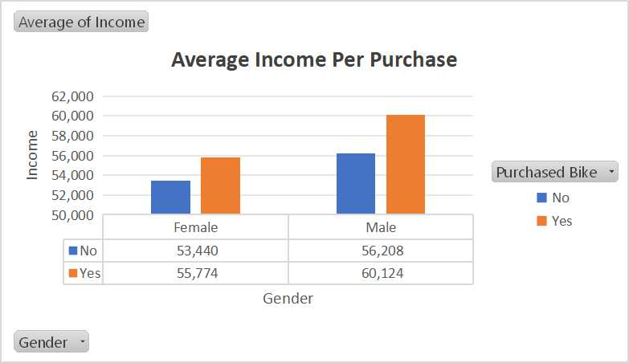
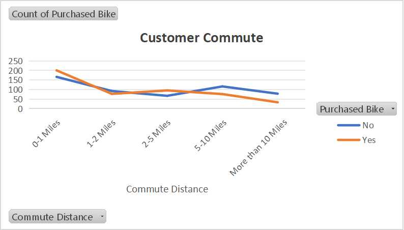
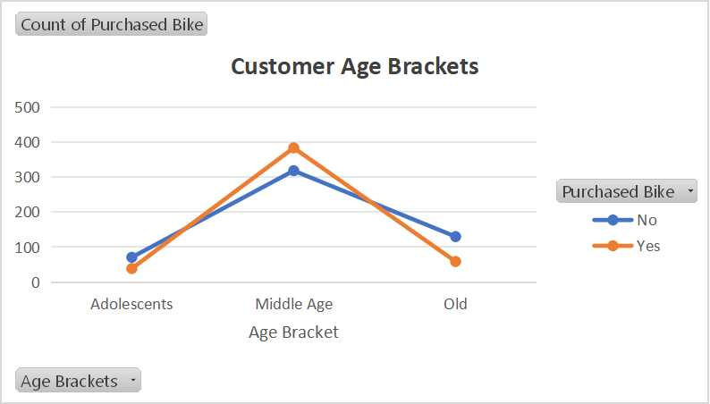

# Bike Sales Excel Project
## About
Analysis of bike sales using data from Alex Freberg and Excel, including data cleaning, exploratory data analysis, and visualization steps to uncover insights that support effective decision-making.
## Analysis Process
The analysis began with data cleaning (removing any missing or incomplete entries) and transformation (standardizing data formats for consistent analysis) in Excel. I analyzed the data to focus on sales trends in relation to gender, income and commute distance. Visualizations were then created, including bar charts and line graphs, to illustrate the comparisons in the purchasing of a bike.
## Data Visualization & Insights

  
  

This chart highlights that higher income correlates with bike purchase. Males have a higher average income than females. Income difference between buyers and non-buyers is larger for males.

Here we see that people with shorter commutes are more likely to purchase a bike. The decision to buy a bike is nearly equal for mid-range commuters (2-5 miles).
Longer commutes (above 5 miles) significantly reduce bike purchases, likely due to practicality concerns.

This line chart highlights that middle-aged individuals are the most significant bike buyers. Adolescents and older individuals are less likely to purchase bikes. The overall trend shows that bike purchases peak in middle age and decline afterward.

## Key Takeaways
- Individuals who purchased a bike have a higher average income compared to those who did not.
- People with shorter commutes are more likely to purchase a bike.
- Middle-aged individuals are the most significant bike buyers.
